# Klassendiagramm – Poke_Proje

Dieses Dokument zeigt das vollständige Klassendiagramm des Projekts (alle Klassen,
Attribute, Methoden, Zugriffsmodifizierer, Beziehungen und Multiplizitäten) sowie
die Erklärung der wichtigsten Beziehungen, wie es die Vorgabe verlangt.

## Diagramm (Mermaid)

```mermaid
classDiagram
    direction LR

    class Program {
        -Main(args: string[]) void
    }

    class NiceCute {
        -Center : PokemonCenter
        -Arena : Arena
        +NiceCute(center: PokemonCenter, arena: Arena)
        +Start() void
        -SelectTrainer() Trainer
        -ShowActionMenu(trainer: Trainer) void
        -DrawBanner() void
    }

    class ConsoleUI {
        <<static>>
        +WriteCentered(text: string) void
        +WriteCenteredHighlighted(text: string, selected: bool, boxWidth: int) void
        +DrawFrame(title: string, lines: IEnumerable~string~, borderColor: ConsoleColor, titleColor: ConsoleColor) void
        +WriteMenuFrame(title: string, items: IEnumerable~string~, selectedIndex: int, borderColor: ConsoleColor) void
    }

    class Arena {
        +Center : PokemonCenter
        +RocketTeam : TeamWH
        -RocketGuard : Pokemon
        -random : Random
        +Arena()
        -ReadNumber(min: int, max: int) int
        +StartBattle(trainer: Trainer) void
        +RocketEncounter(trainer: Trainer) void
        -Fight(me: Pokemon, enemy: Pokemon) void
    }

    class PokemonCenter {
        -pokemonList : List~Pokemon~
        -trainerList : List~Trainer~
        +PokemonCenter()
        +GetAllPokeon() List~Pokemon~
        +GetAllTrainers() List~Trainer~
        +AddPokemon(pokemon: Pokemon) void
        +AddTrainer(trainer: Trainer) void
        +ShowAllPokemon() void
        +ShowAllTrainers() void
        +SearchPokemon(name: string) Pokemon
        +AssignPokeon(pokemon: Pokemon, trainer: Trainer) void
        +GetBehavior(pokemon: Pokemon) void
        +HealPokemon(pokemon: Pokemon) void
        +HealPokemon(name: string) void
        +RemovePokemon(pokemon: Pokemon) bool
    }

    class Trainer {
        +Name : string
        +ass_poke : List~Pokemon~
        +Trainer(name: string)
        -ReadNumber(min: int, max: int) int
        +ChoosePokemonFromTeam() Pokemon
        +AssignPokemon(pokemon: Pokemon) void
        +ShowPokemon() void
        +HealPokemon(pokemon: Pokemon) void
        +HealPokemon(name: string) void
        +HealTeam() void
        +ClearTeam() void
        +HasPokemon() bool
    }

    class TeamWH {
        -evilQuotes : string[]
        -rnd : Random
        +TeamWH(name: string)
        +StealPokemon(victim: Trainer) void
        +AskToBecomeRealTrainer() void
    }

    class Pokemon {
        <<abstract>>
        +Name : string
        #Trainer : string
        #Level : int
        #HP : int
        #MaxHP : int
        #AttackDamage : int
        #Defense : int
        +attacks : List~Attack~
        #Pokemon(name: string, trainer: string, level: int, hp: int, attackDamage: int, defense: int)
        +Behavior()* string
        +SetTrainer(trainer: string) void
        +GetCurrentHp() int
        +GetMaxHp() int
        +GetBattleStatus() string
        +AddAttack(name: string, damage: int) void
        +Attack(p2: Pokemon, attack: Attack) int
        +TakeDamage(damage: int) void
        +IsDefeated() bool
        +Heal() void
        +ShowStatus() string
    }

    class Dramatic {
        +Dramatic(name, trainer, level, hp, attack, defense)
        +Behavior() string
    }
    class Chill {
        +Chill(name, trainer, level, hp, attack, defense)
        +Behavior() string
    }
    class Chaotic {
        +Chaotic(name, trainer, level, hp, attack, defense)
        +Behavior() string
    }
    class Sneaky {
        +Sneaky(name, trainer, level, hp, attackdamage, defense)
        +Behavior() string
    }

    class Attack {
        +Name : string
        +Damage : int
        +Attack(name: string, damage: int)
    }

    class IBattle {
        <<interface>>
        +Attack(p2: Pokemon, attack: Attack) int
        +IsDefeated() bool
    }

    class IHeal {
        <<interface>>
        +Heal() void
        +ShowStatus() string
    }

    %% ---------- Beziehungen ----------
    Program ..> NiceCute : erzeugt
    Program ..> Arena : erzeugt

    NiceCute --> Arena : nutzt
    NiceCute --> PokemonCenter : nutzt

    Arena *-- "1" PokemonCenter : besitzt
    Arena *-- "1" TeamWH : besitzt

    Pokemon <|-- Dramatic
    Pokemon <|-- Chill
    Pokemon <|-- Chaotic
    Pokemon <|-- Sneaky
    Trainer <|-- TeamWH

    Pokemon ..|> IBattle
    Pokemon ..|> IHeal

    Trainer "1" o-- "0..5" Pokemon : Team
    PokemonCenter "1" o-- "0..*" Pokemon : verwaltet
    PokemonCenter "1" o-- "0..*" Trainer : verwaltet
    Pokemon "1" *-- "0..4" Attack : hat
```



## Erklärung der wichtigsten Beziehungen

### 1. `Pokemon` ← `Dramatic`, `Chill`, `Chaotic`, `Sneaky` (Vererbung)
- **Welche Klassen:** die abstrakte Klasse `Pokemon` und die vier konkreten Klassen `Dramatic`, `Chill`, `Chaotic`, `Sneaky`.
- **Art der Beziehung:** Vererbung ("ist ein").
- **Warum gewählt:** Alle vier Arten teilen sich dieselben Attribute (HP, Level, Angriffe, ...) und Methoden (Heilen, Schaden nehmen, ...). Nur das *Verhalten* (`Behavior()`) ist unterschiedlich. Vererbung vermeidet doppelten Code und erlaubt Polymorphie: man kann alle vier über den Typ `Pokemon` behandeln.
- **Im C#-Code:**
  ```csharp
  public abstract class Pokemon : IBattle, IHeal { ... public abstract string Behavior(); }
  public class Dramatic : Pokemon
  {
      public Dramatic(...) : base(...) { }
      public override string Behavior() { return "..."; }
  }
  ```

### 2. `Trainer` ← `TeamWH` (Vererbung)
- **Welche Klassen:** `Trainer` und `TeamWH`.
- **Art der Beziehung:** Vererbung ("ist ein").
- **Warum gewählt:** `TeamWH` ist im Kern ein ganz normaler Trainer (hat einen Namen, ein Team, kann heilen usw.), besitzt aber zusätzlich eigenes, "böses" Verhalten (`StealPokemon`). Statt alles neu zu schreiben, erbt `TeamWH` von `Trainer` und ergänzt nur das Extra-Verhalten.
- **Im C#-Code:**
  ```csharp
  public class TeamWH : Trainer
  {
      public TeamWH(string name) : base(name) { ... }
      public void StealPokemon(Trainer victim) { ... }
  }
  ```

### 3. `Pokemon` → `IBattle`, `IHeal` (Schnittstellenrealisierung)
- **Welche Klassen:** `Pokemon` implementiert die Interfaces `IBattle` und `IHeal`.
- **Art der Beziehung:** Interface-Implementierung ("kann das").
- **Warum gewählt:** So ist klar definiert, was ein kampf- und heilfähiges Objekt können muss (`Attack`, `IsDefeated`, `Heal`, `ShowStatus`), unabhängig von der konkreten Pokémon-Art. Das ist Polymorphie über Interfaces.
- **Im C#-Code:**
  ```csharp
  public abstract class Pokemon : IBattle, IHeal
  {
      public int Attack(Pokemon p2, Attack attack) { ... }
      public bool IsDefeated() { ... }
      public void Heal() { ... }
      public string ShowStatus() { ... }
  }
  ```

### 4. `Trainer` ◇— `Pokemon` (Aggregation, 1 zu 0..5)
- **Welche Klassen:** `Trainer` und `Pokemon`.
- **Art der Beziehung:** Aggregation ("hat ein Team", aber besitzt es nicht exklusiv).
- **Warum gewählt:** Ein Trainer verwaltet eine Liste von maximal 5 Pokémon (`ass_poke`). Ein Pokémon kann aber auch ohne diesen Trainer weiterexistieren (z. B. wenn es gestohlen und einem anderen Trainer zugewiesen wird) – deswegen Aggregation und nicht Komposition.
- **Im C#-Code:**
  ```csharp
  public class Trainer
  {
      public List<Pokemon> ass_poke { get; set; }
  }
  ```

### 5. `Pokemon` ♦— `Attack` (Komposition, 1 zu 0..4)
- **Welche Klassen:** `Pokemon` und `Attack`.
- **Art der Beziehung:** Komposition ("besteht aus").
- **Warum gewählt:** Ein Angriff (`Attack`) gehört fest zu genau einem Pokémon und wird nur über `AddAttack(...)` innerhalb des Pokémon selbst erzeugt. Ohne das Pokémon ergibt der Angriff keinen Sinn und wird nirgendwo sonst wiederverwendet – daher die stärkere Beziehung Komposition.
- **Im C#-Code:**
  ```csharp
  public List<Attack> attacks { get; set; } = new List<Attack>();

  public void AddAttack(string name, int damage)
  {
      attacks.Add(new Attack(name, damage));
  }
  ```

### 6. `Arena` ♦— `PokemonCenter`, `Arena` ♦— `TeamWH` (Komposition, 1 zu 1)
- **Welche Klassen:** `Arena` mit `PokemonCenter` und `TeamWH`.
- **Art der Beziehung:** Komposition ("besitzt fest").
- **Warum gewählt:** Die `Arena` erzeugt `PokemonCenter` und `TeamWH` selbst in ihrem Konstruktor. Beide existieren nur innerhalb genau einer Arena und werden nicht von außen hineingereicht – starke Ownership.
- **Im C#-Code:**
  ```csharp
  public class Arena
  {
      public PokemonCenter Center { get; set; }
      public TeamWH RocketTeam;

      public Arena()
      {
          Center = new PokemonCenter();
          RocketTeam = new TeamWH("Team WH");
      }
  }
  ```

### 7. `PokemonCenter` ◇— `Pokemon`, `PokemonCenter` ◇— `Trainer` (Aggregation, 1 zu 0..*)
- **Welche Klassen:** `PokemonCenter` mit `Pokemon` und `Trainer`.
- **Art der Beziehung:** Aggregation ("verwaltet eine Liste von").
- **Warum gewählt:** Das Center führt Listen über alle Pokémon und Trainer im Spiel, ist aber nicht der einzige "Besitzer" (die Pokémon gehören eigentlich den Trainern, die Trainer existieren unabhängig vom Center-Objekt selbst).
- **Im C#-Code:**
  ```csharp
  public class PokemonCenter
  {
      private List<Pokemon> pokemonList;
      private List<Trainer> trainerList;
  }
  ```

## Zusammenfassung: Wo stecken die OOP-Konzepte?
- **Kapselung:** geschützte Felder in `Pokemon` (`protected`) mit öffentlichen Methoden zum kontrollierten Zugriff (`GetCurrentHp()`, `TakeDamage()`, ...); private Felder in `PokemonCenter`, `Arena`, `TeamWH`.
- **Vererbung:** `Pokemon` → `Dramatic`/`Chill`/`Chaotic`/`Sneaky`, `Trainer` → `TeamWH`.
- **Polymorphie:** `Behavior()` ist in `Pokemon` abstrakt und wird in jeder Unterklasse anders überschrieben; beim Aufruf über die Basisklasse wird automatisch die richtige Variante ausgeführt.
